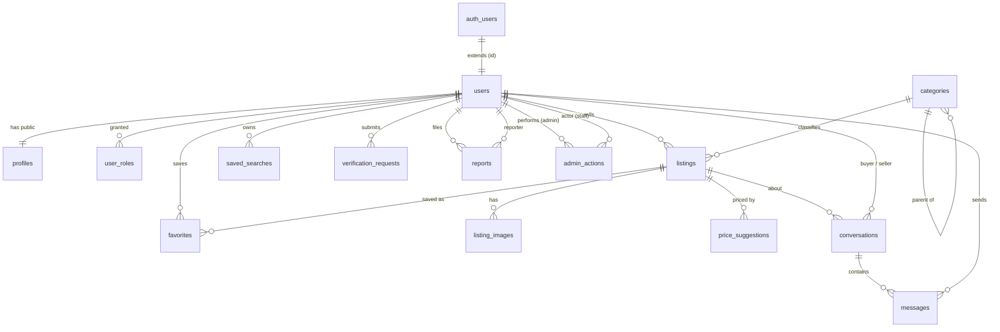

# Query & Buy — Database Design (Supabase / PostgreSQL)

> Target: 100,000+ users, UAE marketplace. Engine: Supabase Postgres 15+.
> This is a **schema design** doc — DDL, indexes, RLS, roles, data flow. No application code.

---

## 0. Supabase-specific ground rules

- **`auth.users` is owned by Supabase Auth** (phone/email/OTP, password hashes, MFA). We never write to it directly. Every app table that needs an owner references `auth.users(id)`.
- We split identity into two public tables on purpose:
  - **`public.users`** — *private account state* (status, locale, trust score, role-relevant flags). Readable only by the owner and staff.
  - **`public.profiles`** — *public seller card* (display name, avatar, badges, rating). Readable by everyone.
- **Row Level Security (RLS) is ON for every table.** Supabase exposes the DB directly to clients via PostgREST, so RLS *is* the authorization layer — there is no app server in front of it to trust.
- Authorization uses `auth.uid()` (the logged-in user's id from the JWT) inside policies, plus `SECURITY DEFINER` helper functions for roles to avoid RLS recursion.
- Money = `bigint` **fils** (1 AED = 100 fils). Never floats.
- PKs = `uuid default gen_random_uuid()`. Timestamps = `timestamptz default now()`.
- Extensions enabled: `pgcrypto` (UUIDs), `postgis` (geo), `vector` (similarity), `pg_trgm` (fuzzy text).

---

## 1. ER Diagram



Entity-relationship in words:

- `auth.users (1) ── (1) public.users ── (1) public.profiles` — one identity, one account row, one public card.
- `users (1) ──< listings (∞)` — a seller has many listings.
- `categories` self-references for a tree; `categories (1) ──< listings (∞)`.
- `listings (1) ──< listing_images / price_suggestions / conversations / favorites`.
- `conversations (1) ──< messages (∞)`; a conversation is unique per `(listing, buyer)`.
- `users` is the actor on `reports`, `admin_actions`, `user_roles`, `verification_requests`.

---

## 2. Complete Database Tables (DDL)

### 2.0 Extensions, enums, role helpers

```sql
create extension if not exists pgcrypto;
create extension if not exists postgis;
create extension if not exists vector;
create extension if not exists pg_trgm;

-- ---------- enums ----------
create type user_status        as enum ('active','suspended','banned','deleted');
create type app_role           as enum ('user','moderator','admin','super_admin');
create type emirate            as enum ('dubai','abu_dhabi','sharjah','ajman',
                                        'umm_al_quwain','ras_al_khaimah','fujairah');
create type listing_status     as enum ('draft','pending_review','active','sold',
                                        'expired','rejected','deleted');
create type listing_condition  as enum ('new','like_new','used','for_parts');
create type verification_type  as enum ('mobile','email','emirates_id');
create type verification_status as enum ('pending','verified','failed','expired','rejected');
create type conversation_status as enum ('open','archived','blocked');
create type report_target      as enum ('listing','user','message');
create type report_reason      as enum ('scam','prohibited','spam','offensive',
                                        'wrong_category','counterfeit','other');
create type report_status      as enum ('open','reviewing','actioned','dismissed');
create type admin_action_type  as enum ('approve_listing','reject_listing','remove_listing',
                                        'suspend_user','ban_user','reinstate_user',
                                        'verify_user','dismiss_report','other');

-- ---------- role helpers (SECURITY DEFINER avoids RLS recursion) ----------
create or replace function public.has_role(_role app_role)
returns boolean language sql stable security definer set search_path = public as $$
  select exists (select 1 from public.user_roles
                 where user_id = auth.uid() and role = _role);
$$;

create or replace function public.is_staff()
returns boolean language sql stable security definer set search_path = public as $$
  select exists (select 1 from public.user_roles
                 where user_id = auth.uid()
                   and role in ('moderator','admin','super_admin'));
$$;

create or replace function public.is_admin()
returns boolean language sql stable security definer set search_path = public as $$
  select exists (select 1 from public.user_roles
                 where user_id = auth.uid()
                   and role in ('admin','super_admin'));
$$;

-- generic updated_at trigger
create or replace function public.touch_updated_at()
returns trigger language plpgsql as $$
begin new.updated_at = now(); return new; end; $$;
```

### 2.1 `users` — private account state (1:1 with `auth.users`)

```sql
create table public.users (
  id             uuid primary key references auth.users(id) on delete cascade,
  phone_e164     text unique,                       -- mirrored from auth for app queries
  email          citext unique,
  status         user_status not null default 'active',
  locale         text not null default 'en',        -- 'en' | 'ar'
  trust_score    smallint not null default 0,       -- derived, cached
  has_mobile_verified bool not null default false,
  has_email_verified  bool not null default false,
  has_eid_verified    bool not null default false,
  flagged        bool not null default false,        -- safety hold
  last_active_at timestamptz,
  created_at     timestamptz not null default now(),
  updated_at     timestamptz not null default now(),
  deleted_at     timestamptz
);
create trigger trg_users_touch before update on public.users
  for each row execute function public.touch_updated_at();
```

### 2.2 `profiles` — public seller card (1:1 with `users`)

```sql
create table public.profiles (
  id            uuid primary key references public.users(id) on delete cascade,
  display_name  text not null,
  avatar_url    text,
  bio           text,
  emirate       emirate,                            -- primary location for the seller card
  badge_level   text not null default 'none',       -- none | basic | verified
  rating_avg    numeric(2,1) not null default 0,    -- 0.0–5.0
  rating_count  integer not null default 0,
  listings_count integer not null default 0,        -- denormalized counter
  member_since  timestamptz not null default now(),
  updated_at    timestamptz not null default now()
);
create trigger trg_profiles_touch before update on public.profiles
  for each row execute function public.touch_updated_at();
```

### 2.3 `user_roles` — RBAC

```sql
create table public.user_roles (
  user_id    uuid not null references public.users(id) on delete cascade,
  role       app_role not null default 'user',
  granted_by uuid references public.users(id),
  granted_at timestamptz not null default now(),
  primary key (user_id, role)
);
```

### 2.4 `categories` — hierarchical catalog

```sql
create table public.categories (
  id         uuid primary key default gen_random_uuid(),
  parent_id  uuid references public.categories(id) on delete restrict,
  slug       text unique not null,
  name_en    text not null,
  name_ar    text not null,
  icon       text,
  position   smallint not null default 0,
  is_active  bool not null default true,
  created_at timestamptz not null default now()
);
```

### 2.5 `listings` — the core marketplace object

```sql
create table public.listings (
  id            uuid primary key default gen_random_uuid(),
  seller_id     uuid not null references public.users(id) on delete cascade,
  category_id   uuid not null references public.categories(id) on delete restrict,
  title_en      text not null,
  title_ar      text,
  description   text not null,
  attributes    jsonb not null default '{}',        -- category-specific (make, mileage, size…)
  price_fils    bigint not null check (price_fils >= 0),
  currency      char(3) not null default 'AED',
  is_negotiable bool not null default true,
  condition     listing_condition not null default 'used',
  status        listing_status not null default 'draft',
  emirate       emirate,
  area          text,
  location      geography(Point,4326),              -- optional precise pin
  is_urgent     bool not null default false,
  urgent_until  timestamptz,
  ai_generated  bool not null default false,
  view_count    integer not null default 0,
  search_vector tsvector,                           -- generated below for FTS
  published_at  timestamptz,
  expires_at    timestamptz,                        -- e.g. published_at + 30d
  created_at    timestamptz not null default now(),
  updated_at    timestamptz not null default now(),
  deleted_at    timestamptz
);

-- bilingual full-text search vector (English + Arabic config + simple fallback)
alter table public.listings
  add column search_vector tsvector
  generated always as (
    setweight(to_tsvector('simple', coalesce(title_en,'') || ' ' || coalesce(title_ar,'')), 'A') ||
    setweight(to_tsvector('simple', coalesce(description,'')), 'B')
  ) stored;

create trigger trg_listings_touch before update on public.listings
  for each row execute function public.touch_updated_at();
```

> Note: `search_vector` is declared twice above for readability — in production keep only the generated-column form (remove the plain column from the `create table`). Postgres FTS handles the search path for the MVP; OpenSearch is a **deferred post-MVP** scale-out option, not part of Phase 1.

### 2.6 `listing_images`

```sql
create table public.listing_images (
  id          uuid primary key default gen_random_uuid(),
  listing_id  uuid not null references public.listings(id) on delete cascade,
  storage_key text not null,                        -- Supabase Storage object path
  cdn_url     text,
  position    smallint not null default 0,
  width       int,
  height      int,
  ai_labels   jsonb,                                -- vision: detected objects/scene
  is_safe     bool not null default true,           -- moderation gate before public
  created_at  timestamptz not null default now()
);
```

### 2.7 `listing_embeddings` — similar products (pgvector)

```sql
create table public.listing_embeddings (
  listing_id uuid primary key references public.listings(id) on delete cascade,
  embedding  vector(1024),
  model      text,
  updated_at timestamptz not null default now()
);
```

### 2.8 `price_suggestions`

```sql
create table public.price_suggestions (
  id                 uuid primary key default gen_random_uuid(),
  listing_id         uuid references public.listings(id) on delete cascade,
  user_id            uuid references public.users(id) on delete set null,
  suggested_min_fils bigint not null,
  suggested_max_fils bigint not null,
  suggested_point_fils bigint,
  basis              text not null default 'comparables',  -- comparables | model
  comparables        jsonb,                                -- listing ids + prices used
  model              text,
  created_at         timestamptz not null default now()
);
```

### 2.9 `conversations` + `messages`

```sql
create table public.conversations (
  id              uuid primary key default gen_random_uuid(),
  listing_id      uuid not null references public.listings(id) on delete cascade,
  buyer_id        uuid not null references public.users(id) on delete cascade,
  seller_id       uuid not null references public.users(id) on delete cascade,
  status          conversation_status not null default 'open',
  last_message_at timestamptz,
  buyer_unread    smallint not null default 0,
  seller_unread   smallint not null default 0,
  created_at      timestamptz not null default now(),
  unique (listing_id, buyer_id)                     -- one thread per buyer per listing
);

create table public.messages (
  id              uuid primary key default gen_random_uuid(),
  conversation_id uuid not null references public.conversations(id) on delete cascade,
  sender_id       uuid not null references public.users(id) on delete cascade,
  body            text,
  attachments     jsonb,                            -- [{key,type}]
  flagged         bool not null default false,      -- scam/abuse detector
  read_at         timestamptz,
  created_at      timestamptz not null default now()
);
```

> At 100k users the high-volume tables (`messages`, plus any `audit_log`/`search_events`) should be **range-partitioned by month**. Supabase supports declarative partitioning; create `messages` as `partition by range (created_at)` with monthly child partitions provisioned ahead by a scheduled job.

### 2.10 `saved_searches`

```sql
create table public.saved_searches (
  id             uuid primary key default gen_random_uuid(),
  user_id        uuid not null references public.users(id) on delete cascade,
  label          text,
  query_text     text,                              -- raw NL query
  parsed_filters jsonb not null default '{}',       -- {category,price,emirate,attrs}
  notify         bool not null default true,
  notify_channel text not null default 'push',      -- push | email
  last_run_at    timestamptz,
  last_match_at  timestamptz,
  created_at     timestamptz not null default now()
);
```

### 2.11 `favorites`

```sql
create table public.favorites (
  user_id    uuid not null references public.users(id) on delete cascade,
  listing_id uuid not null references public.listings(id) on delete cascade,
  created_at timestamptz not null default now(),
  primary key (user_id, listing_id)
);
```

### 2.12 `verification_requests` — trust ladder (KYC kept lean)

```sql
create table public.verification_requests (
  id           uuid primary key default gen_random_uuid(),
  user_id      uuid not null references public.users(id) on delete cascade,
  type         verification_type not null,
  status       verification_status not null default 'pending',
  source       text,                                -- 'uae_pass' | 'otp' | 'manual_doc'
  -- PII minimized: only references to encrypted Storage objects, never raw EID columns here
  eid_number_hash text,                             -- HMAC for one-ID-one-account dedupe
  doc_front_key   text,                             -- private Storage bucket key
  doc_back_key    text,
  metadata     jsonb,                               -- non-PII verification metadata
  reviewed_by  uuid references public.users(id),
  reviewed_at  timestamptz,
  created_at   timestamptz not null default now(),
  updated_at   timestamptz not null default now()
);
create unique index uq_eid_hash on public.verification_requests(eid_number_hash)
  where eid_number_hash is not null;            -- enforce one Emirates ID = one account
create trigger trg_verif_touch before update on public.verification_requests
  for each row execute function public.touch_updated_at();
```

### 2.13 `reports`

```sql
create table public.reports (
  id          uuid primary key default gen_random_uuid(),
  reporter_id uuid not null references public.users(id) on delete set null,
  target_type report_target not null,
  target_id   uuid not null,                        -- polymorphic (listing/user/message)
  reason      report_reason not null,
  details     text,
  status      report_status not null default 'open',
  resolved_by uuid references public.users(id),
  resolved_at timestamptz,
  created_at  timestamptz not null default now()
);
```

### 2.14 `admin_actions` — staff audit trail (append-only)

```sql
create table public.admin_actions (
  id          uuid primary key default gen_random_uuid(),
  admin_id    uuid not null references public.users(id) on delete set null,
  action      admin_action_type not null,
  target_type report_target,
  target_id   uuid,
  reason      text,
  metadata    jsonb,
  created_at  timestamptz not null default now()
);
```

---

## 3. Relationships (FK summary)

| Child | FK column | Parent | On delete | Cardinality |
|---|---|---|---|---|
| users | id | auth.users | cascade | 1:1 |
| profiles | id | users | cascade | 1:1 |
| user_roles | user_id | users | cascade | 1:N |
| categories | parent_id | categories | restrict | tree |
| listings | seller_id | users | cascade | 1:N |
| listings | category_id | categories | restrict | 1:N |
| listing_images | listing_id | listings | cascade | 1:N |
| listing_embeddings | listing_id | listings | cascade | 1:1 |
| price_suggestions | listing_id | listings | cascade | 1:N |
| conversations | listing_id / buyer_id / seller_id | listings / users | cascade | 1:N |
| messages | conversation_id | conversations | cascade | 1:N |
| messages | sender_id | users | cascade | 1:N |
| saved_searches | user_id | users | cascade | 1:N |
| favorites | user_id / listing_id | users / listings | cascade | M:N |
| verification_requests | user_id | users | cascade | 1:N |
| reports | reporter_id | users | set null | 1:N |
| admin_actions | admin_id | users | set null | 1:N |

`category_id` and `parent_id` use **`restrict`** so you can't orphan listings by deleting a live category — categories are deactivated (`is_active=false`), not deleted. Everything owned-by-user uses **`cascade`** so account deletion (a PDPL data-subject erasure request) removes the user's data cleanly. `reporter_id`/`admin_id` use **`set null`** so the audit/report record survives the actor's deletion.

---

## 4. Indexes

```sql
-- users / profiles
create index idx_users_status        on public.users(status) where deleted_at is null;
create index idx_profiles_emirate     on public.profiles(emirate);
create index idx_profiles_name_trgm   on public.profiles using gin (display_name gin_trgm_ops);

-- categories
create index idx_categories_parent    on public.categories(parent_id);

-- listings: the hot paths (browse active, by category, by seller, geo, urgent, FTS)
create index idx_listings_status_pub  on public.listings(status, published_at desc)
                                       where status = 'active' and deleted_at is null;
create index idx_listings_category    on public.listings(category_id, status);
create index idx_listings_seller      on public.listings(seller_id);
create index idx_listings_emirate_cat on public.listings(emirate, category_id)
                                       where status = 'active';
create index idx_listings_geo         on public.listings using gist (location);
create index idx_listings_urgent      on public.listings(urgent_until)
                                       where is_urgent and status = 'active';
create index idx_listings_fts         on public.listings using gin (search_vector);
create index idx_listings_attrs       on public.listings using gin (attributes jsonb_path_ops);

-- similarity
create index idx_embeddings_ivf       on public.listing_embeddings
                                       using ivfflat (embedding vector_cosine_ops) with (lists = 200);

-- images
create index idx_images_listing       on public.listing_images(listing_id, position);

-- messaging (inbox queries sort by recency)
create index idx_conv_seller          on public.conversations(seller_id, last_message_at desc);
create index idx_conv_buyer           on public.conversations(buyer_id, last_message_at desc);
create index idx_messages_conv        on public.messages(conversation_id, created_at desc);
create index idx_messages_unread      on public.messages(conversation_id) where read_at is null;

-- discovery / trust / safety
create index idx_saved_user           on public.saved_searches(user_id);
create index idx_saved_notify         on public.saved_searches(user_id) where notify;
create index idx_fav_user             on public.favorites(user_id, created_at desc);
create index idx_verif_user_type      on public.verification_requests(user_id, type);
create index idx_reports_status       on public.reports(status, created_at desc);
create index idx_reports_target       on public.reports(target_type, target_id);
create index idx_admin_actions_target on public.admin_actions(target_type, target_id, created_at desc);
create index idx_user_roles_lookup    on public.user_roles(user_id, role);
```

**Why these:** the `status='active'` partial indexes keep the buyer-facing browse/search cheap regardless of how many drafts/expired rows accumulate. GIN on `search_vector` powers bilingual FTS; GIN on `attributes` powers faceted filters (e.g. `attributes @> '{"make":"Toyota"}'`). The `ivfflat` index serves "similar products". Inbox queries are covered by `(seller_id|buyer_id, last_message_at desc)`.

---

## 5. Row Level Security Policies

Enable RLS everywhere, then grant precisely. **Default state with RLS on and no policy = deny all** — which is what we want for anything unlisted.

```sql
alter table public.users                 enable row level security;
alter table public.profiles              enable row level security;
alter table public.user_roles            enable row level security;
alter table public.categories            enable row level security;
alter table public.listings              enable row level security;
alter table public.listing_images        enable row level security;
alter table public.listing_embeddings    enable row level security;
alter table public.price_suggestions     enable row level security;
alter table public.conversations         enable row level security;
alter table public.messages              enable row level security;
alter table public.saved_searches        enable row level security;
alter table public.favorites             enable row level security;
alter table public.verification_requests enable row level security;
alter table public.reports               enable row level security;
alter table public.admin_actions         enable row level security;
```

### 5.1 users — owner + staff read, owner-limited write

```sql
create policy users_self_read on public.users
  for select using (id = auth.uid() or public.is_staff());

create policy users_self_update on public.users
  for update using (id = auth.uid())
  with check (id = auth.uid());
-- status/role/flagged changes happen only via SECURITY DEFINER admin functions,
-- never via direct client update — so no broad staff UPDATE policy here.
```

### 5.2 profiles — public read, owner write

```sql
create policy profiles_public_read on public.profiles
  for select using (true);

create policy profiles_owner_write on public.profiles
  for update using (id = auth.uid()) with check (id = auth.uid());

create policy profiles_owner_insert on public.profiles
  for insert with check (id = auth.uid());
```

### 5.3 user_roles — read own, only admins mutate

```sql
create policy roles_read on public.user_roles
  for select using (user_id = auth.uid() or public.is_staff());

create policy roles_admin_write on public.user_roles
  for all using (public.is_admin()) with check (public.is_admin());
```

### 5.4 categories — public read, admin write

```sql
create policy categories_public_read on public.categories
  for select using (is_active or public.is_staff());

create policy categories_admin_write on public.categories
  for all using (public.is_admin()) with check (public.is_admin());
```

### 5.5 listings — public sees active; owner sees own; staff sees all

```sql
create policy listings_read on public.listings
  for select using (
    (status = 'active' and deleted_at is null)   -- public browse
    or seller_id = auth.uid()                    -- own drafts/sold/etc.
    or public.is_staff()                         -- moderation
  );

create policy listings_owner_insert on public.listings
  for insert with check (seller_id = auth.uid());

create policy listings_owner_update on public.listings
  for update using (seller_id = auth.uid() or public.is_staff())
  with check (seller_id = auth.uid() or public.is_staff());

create policy listings_owner_delete on public.listings
  for delete using (seller_id = auth.uid() or public.is_admin());
```

### 5.6 listing_images — visible when the parent listing is visible

```sql
create policy images_read on public.listing_images
  for select using (
    exists (select 1 from public.listings l
            where l.id = listing_id
              and ( (l.status='active' and l.deleted_at is null)
                    or l.seller_id = auth.uid() or public.is_staff() ))
  );

create policy images_owner_write on public.listing_images
  for all using (
    exists (select 1 from public.listings l
            where l.id = listing_id and l.seller_id = auth.uid())
  ) with check (
    exists (select 1 from public.listings l
            where l.id = listing_id and l.seller_id = auth.uid())
  );
```

### 5.7 price_suggestions — owner of the listing / requester

```sql
create policy price_read on public.price_suggestions
  for select using (
    user_id = auth.uid()
    or exists (select 1 from public.listings l
               where l.id = listing_id and l.seller_id = auth.uid())
    or public.is_staff()
  );
-- writes come from the AI worker via service_role (bypasses RLS), so no client write policy.
```

### 5.8 conversations + messages — strictly the two participants

```sql
-- participant helper (avoids correlated-subquery duplication in message policies)
create or replace function public.is_conversation_participant(_conv uuid)
returns boolean language sql stable security definer set search_path = public as $$
  select exists (select 1 from public.conversations c
                 where c.id = _conv
                   and (c.buyer_id = auth.uid() or c.seller_id = auth.uid()));
$$;

create policy conv_participant_read on public.conversations
  for select using (buyer_id = auth.uid() or seller_id = auth.uid() or public.is_staff());

create policy conv_buyer_insert on public.conversations
  for insert with check (buyer_id = auth.uid() and buyer_id <> seller_id);

create policy conv_participant_update on public.conversations
  for update using (buyer_id = auth.uid() or seller_id = auth.uid())
  with check (buyer_id = auth.uid() or seller_id = auth.uid());

create policy msg_participant_read on public.messages
  for select using (public.is_conversation_participant(conversation_id) or public.is_staff());

create policy msg_participant_send on public.messages
  for insert with check (
    sender_id = auth.uid()
    and public.is_conversation_participant(conversation_id)
    and not exists (select 1 from public.conversations c
                    where c.id = conversation_id and c.status = 'blocked')
  );
```

### 5.9 saved_searches & favorites — private to owner

```sql
create policy saved_owner_all on public.saved_searches
  for all using (user_id = auth.uid()) with check (user_id = auth.uid());

create policy fav_owner_all on public.favorites
  for all using (user_id = auth.uid()) with check (user_id = auth.uid());
```

### 5.10 verification_requests — owner submits, staff reviews

```sql
create policy verif_owner_read on public.verification_requests
  for select using (user_id = auth.uid() or public.is_staff());

create policy verif_owner_insert on public.verification_requests
  for insert with check (user_id = auth.uid());

create policy verif_staff_update on public.verification_requests
  for update using (public.is_staff()) with check (public.is_staff());
```

### 5.11 reports — anyone authenticated files; staff manages

```sql
create policy reports_insert on public.reports
  for insert with check (reporter_id = auth.uid());

create policy reports_read on public.reports
  for select using (reporter_id = auth.uid() or public.is_staff());

create policy reports_staff_update on public.reports
  for update using (public.is_staff()) with check (public.is_staff());
```

### 5.12 admin_actions — staff read, append-only, no update/delete

```sql
create policy admin_actions_read on public.admin_actions
  for select using (public.is_staff());

create policy admin_actions_insert on public.admin_actions
  for insert with check (public.is_staff() and admin_id = auth.uid());
-- deliberately NO update/delete policy → audit log is immutable to clients.
```

> **Backend writes use `service_role`**, which bypasses RLS by design. The AI worker (price suggestions, embeddings, moderation verdicts, status transitions) and the notification worker run with the service key and are the *only* paths allowed to mutate system-owned columns. Clients never get the service key.

---

## 6. User Roles

Two layers, because Supabase has both a Postgres-role layer and an app-role layer.

**A. Postgres / PostgREST roles (set by Supabase, selected by the JWT):**

| Role | Who | Access |
|---|---|---|
| `anon` | unauthenticated visitor | only what public `SELECT` policies allow (active listings, public profiles, categories) |
| `authenticated` | any logged-in user | everything gated by `auth.uid()` policies above |
| `service_role` | backend workers only | **bypasses RLS** — used for AI/notification/moderation jobs; key never ships to clients |

**B. Application roles (`public.user_roles`, checked in policies via `has_role` / `is_staff` / `is_admin`):**

| App role | Capabilities |
|---|---|
| `user` | default. Buy + sell: manage own listings, messages, saved searches, favorites, verification, file reports. |
| `moderator` | + read all listings/reports/conversations, act on moderation queue, suspend listings, resolve reports. Writes audited to `admin_actions`. |
| `admin` | + manage categories, manage `user_roles`, suspend/ban users, approve KYC. |
| `super_admin` | + grant admin, destructive/config operations. Smallest possible group. |

**Role-change integrity:** clients can never self-promote — `user_roles` write is gated by `is_admin()`, and sensitive `users` columns (`status`, `flagged`) are only mutated through `SECURITY DEFINER` admin functions that also write an `admin_actions` row in the same transaction. Optionally mirror the role into a **custom JWT claim** via an auth hook so `is_staff()` can read from the token instead of hitting the table on every request (cheaper at 100k users).

---

## 7. Data Flow

**7.1 Signup & profile bootstrap**
`auth.users` row created by Supabase Auth (phone OTP) → DB trigger `on auth.users insert` → inserts matching `public.users` + `public.profiles` + default `user_roles('user')` rows in one transaction. `has_mobile_verified` set true on first successful OTP.

**7.2 AI Photo → Listing (the 60-second flow)**
Client uploads photos to a **private Storage bucket** → inserts `listings` row (`status='draft'`, `ai_generated=true`) → enqueues an AI job (external worker) → worker (service_role): image safety check (sets `listing_images.is_safe`), Claude vision fills `title/description/attributes`, writes a `price_suggestions` row, generates a `listing_embeddings` vector → listing moves to `pending_review` (new sellers) or `active` (trusted) → on `active`, `published_at`/`expires_at` set and the row is indexed for search via Postgres FTS.

**7.3 Browse / Conversational search**
Buyer query → NL parsed to `parsed_filters` → query hits Postgres FTS (`search_vector @@ query` + `attributes @>` facets + `emirate`/`price` filters), constrained by RLS to `status='active'` (OpenSearch is a deferred post-MVP scale path). Results ranked, urgent listings boosted. "Similar products" = `ivfflat` nearest-neighbor on `listing_embeddings`.

**7.4 Save search & alerts**
Buyer saves `parsed_filters` → on each new `active` listing, a worker matches it against `saved_searches where notify` → push/email via `device_push_tokens`; stamps `last_match_at`.

**7.5 Messaging**
Buyer opens a listing → `conversations` upserted (unique `listing+buyer`) → `messages` inserted (RLS: sender must be a participant, conversation not `blocked`) → Supabase **Realtime** streams the row to the other participant; offline → push. Unread counters maintained by trigger; scam detector may set `flagged`.

**7.6 Emirates ID verification**
User starts UAE PASS (or manual doc upload to a private bucket) → `verification_requests` row (`type='emirates_id'`, `eid_number_hash` HMAC enforces one-ID-one-account via the unique index) → staff/worker reviews → on `verified`: set `users.has_eid_verified=true`, `profiles.badge_level='verified'`; manual doc keys purged per retention policy.

**7.7 Report → Moderation → Action**
Any user files a `reports` row → appears in staff queue (RLS `is_staff`) → moderator acts (suspend listing, ban user) through a `SECURITY DEFINER` function that, in one transaction, updates the target **and** appends an immutable `admin_actions` row → `reports.status` resolved. The audit trail is unforgeable: `admin_actions` has insert-only RLS and no update/delete policy.

---

## 8. Scale notes for 100k+ users (carried from the architecture doc)

- **Partition `messages`** (and any `audit`/`search_events`) by month; pre-create partitions via a scheduled job.
- **Partial indexes on `status='active'`** keep buyer paths flat as dead rows accumulate.
- **Denormalized counters** (`profiles.listings_count`, `rating_*`, `conversations.*_unread`, `users.trust_score`) avoid aggregate joins on hot reads; maintained by triggers.
- **Postgres FTS serves browse/search** for the MVP; an OpenSearch mirror is a deferred post-MVP option if volume demands it.
- **Move role checks into a JWT claim** (auth hook) to avoid a `user_roles` read on every policy evaluation.
- **`pgvector ivfflat`** is fine to ~1M rows; revisit `lists` tuning or HNSW as the catalog grows.
- Connection pressure: use **Supabase connection pooler (PgBouncer, transaction mode)** for the API; reserve direct connections for migrations/workers.
```
